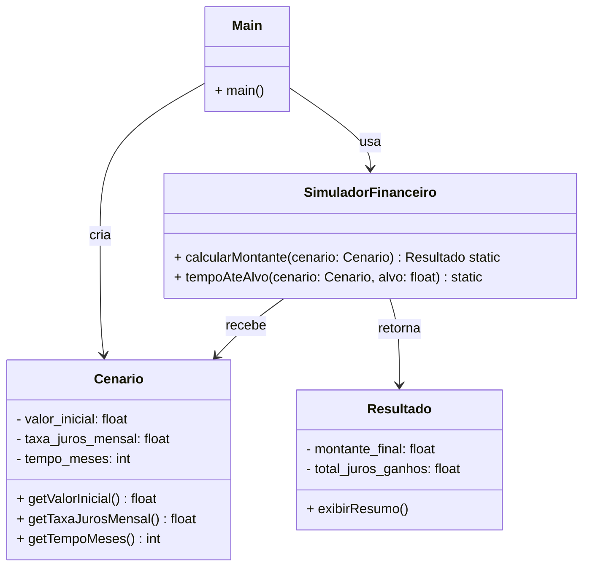

# Diagrama UML - Simulador Financeiro

## Estrutura do Projeto

## Descrição das Classes

### Cenario
- Encapsula os parâmetros da simulação financeira
- Atributos:
  - `valor_inicial`: valor inicial do investimento (float)
  - `taxa_juros_mensal`: taxa de juros mensal em porcentagem (float)
  - `tempo_meses`: período da simulação em meses (int)
- Getters para acessar os atributos de forma encapsulada

### Resultado
- Armazena os resultados da simulação
- Atributos:
  - `montante_final`: valor final do investimento (float)
  - `total_juros_ganhos`: juros obtidos (float)
- Método `exibirResumo()`: exibe um resumo dos resultados

### SimuladorFinanceiro
- Classe utilitária com métodos estáticos para cálculos financeiros
- `calcularMontante(cenario)`: 
  - Implementado com fórmula de juros compostos: M = P(1 + i/100)^t
  - Retorna um objeto Resultado com montante e juros
- `tempoAteAlvo(cenario, alvo)`: calcula o tempo necessário para atingir um alvo (em desenvolvimento)

### Main
- Ponto de entrada da aplicação (__main__.py)
- Cria uma instância de Cenario com valores de exemplo (R$ 1000, 30% a.m., 12 meses)
- Executa a simulação através do SimuladorFinanceiro

## Fluxo de Execução

1. Main cria um Cenario com parâmetros iniciais
2. Main instancia SimuladorFinanceiro
3. SimuladorFinanceiro.calcularMontante() recebe o Cenario
4. Calcula o montante final usando a fórmula de juros compostos
5. Retorna um objeto Resultado com os cálculos
6. O resultado é armazenado e pode ser exibido via exibirResumo()
